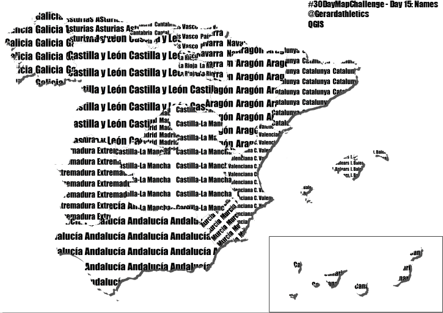
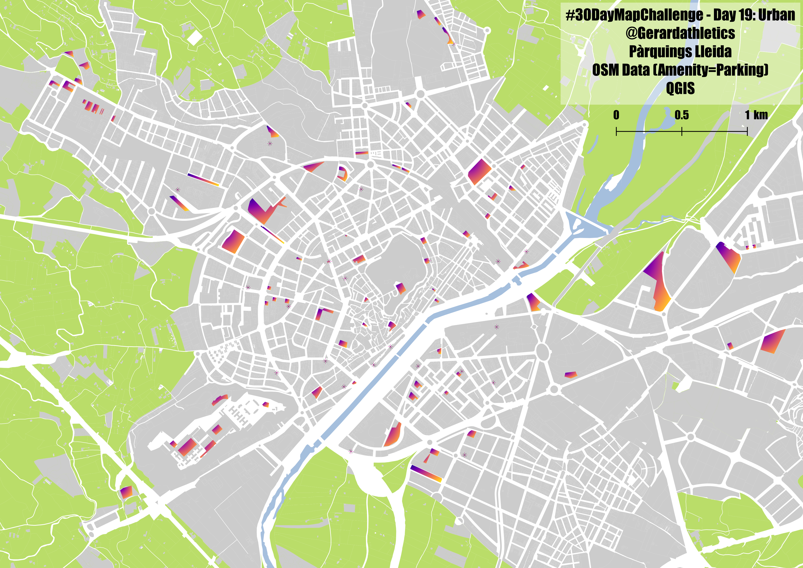

# Maps-Projects
This is my repository for personal and leisure map-related projects.

## 30 Day Map Challenge
Twitter Challenge where you make a daily map related to a given topic.
Created by -> [Topi Tjukanov's #30dayMapChallenge](https://twitter.com/tjukanov/status/1187713840550744066)

  
<b>Day by day list</b> (click to expand)

<!-- toc -->
| Day | Theme                    |Title                                    |Study Area| Map                                            |
| --: | :----------------------- |:----------------------------------------|:---------| :----------------------------------------------------------------- |
|   1 | [Points](https://github.com/gerardathletics/Maps-Projects/blob/master/30DMC/1-Points.md)                      |Athletics Tracks and Approval Status|Catalunya|                   |
|   2 | [Lines ](d02Lines.md)                       |Bus Lines: Where do they meet more|Lleida|             |
|   3 | [Polygons](d03Polygons.md)                  |Voronoi Regions based on Athletics Tracks|Catalunya|          |
|   4 | [Hexagons](d04Hexagons.md)                  |Swimming Pools / Athletes / Tracks|Alpicat / Catalunya|          |
|   5 | [Raster](d05Raster.md)                      |Relieve|Camarasa|            |
|   6 | [Blue](d06Blue.md)                          |Main Rivers|Catalunya|              |
|   7 | [Red](d07Red.md)                            |Urban Areas|Catalunya|               |
|   8 | [Green](d08Green.md)                        |Forest Typologies|Catalunya|             |
|   9 | [Yellow](d09Yellow.md)                      |Athletics Federation Licenses|Catalunya|            |
|  10 | [Black and white](d10BlackAndWhite.md)      |Buildings|Wageningen|     |
|  11 | [Elevation](d11Elevation.md)                |Lego|Lleida Province|         |
|  12 | [Movement](d12Movement.md)                  |2019 Movements|Catalunya/Brasil/Europe|          |
|  13 | [Tracks](d13Tracks.md)                      |Rail tracks|Catalunya|            |
|  14 | [Boundaries](d14Boundaries.md)              |Main Watersheds|Spain|        |
|  15 | [Names](d15Names.md)                        |Autonomous Comunities Names|Spain|             |
|  16 | [Places](d16Places.md)                      |Peaks over 2000m|Catalunya|            |
|  17 | [Zones](d17Zones.md)                        |Censal Areas|Catalunya's Provinces Capitals|             |
|  18 | [Globe](d18Globe.md)                        |Projections|World|             |
|  19 | [Urban](d19Urban.md)                        |Parking Areas|Lleida|             |
|  20 | [Rural](d20Rural.md)                        |Agricultural Areas|Spain|             |
|  21 | [Environment](d21Environment.md)            |Biogeographical Regions|Spain|       |
|  22 | [Built environment](d22BuiltEnvironment.md) ||| In process... |
|  23 | [Population](d23Population.md)              ||| In process...      |
|  24 | [Statistics](d24Statistics.md)              ||| In process...       |
|  25 | [Climate](d25Climate.md)                    ||| In process...         |
|  26 | [Hydrology](d26Hydrology.md)                ||| In process...        |
|  27 | [Resources](d27Resources.md)                ||| In process...        |
|  28 | [Funny](d28Funny.md)                        ||| In process...        |
|  29 | [Experimental](d29Experimental.md)          ||| In process...     |
|  30 | [Home](d30Home.md)                          ||| In process...            |
<!-- tocstop -->

